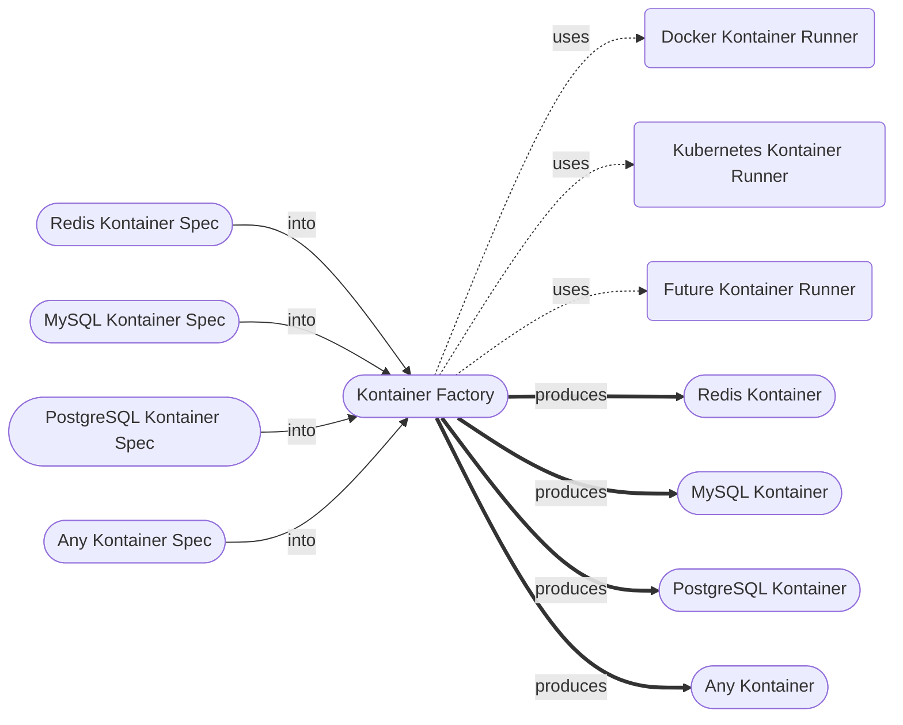

# Test Flowy

```mermaid
  flowchart LR;
    S1([Redis Kontainer Spec]) & S2([MySQL Kontainer Spec]) & S3([PostgreSQL Kontainer Spec]) & S4([Any Kontainer Spec]) -- into --> Factory([Kontainer Factory])
    Factory -. uses .-> DR(Docker Kontainer Runner) & KR(Kubernetes Kontainer Runner) & X(Future Kontainer Runner)
    Factory == produces ==> RK([Redis Kontainer]) & MK([MySQL Kontainer]) & PK([PostgreSQL Kontainer]) & AK([Any Kontainer])
```
