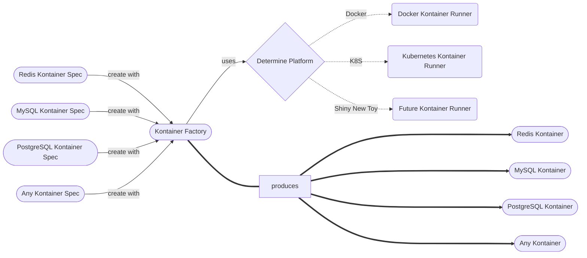

# Test Flowy

```mermaid
  flowchart LR;
    S1([Redis Kontainer Spec]) & S2([MySQL Kontainer Spec]) & S3([PostgreSQL Kontainer Spec]) & S4([Any Kontainer Spec]) -- create with --> Factory([Kontainer Factory])
    Factory -- uses --> Platform{Determine Platform}
    Platform -. Docker .-> DR(Docker Kontainer Runner)
    Platform -. K8S .-> KR(Kubernetes Kontainer Runner) 
    Platform -. Shiny New Toy .-> X(Future Kontainer Runner)
    Factory === produces ===> RK([Redis Kontainer]) & MK([MySQL Kontainer]) & PK([PostgreSQL Kontainer]) & AK([Any Kontainer])
```
